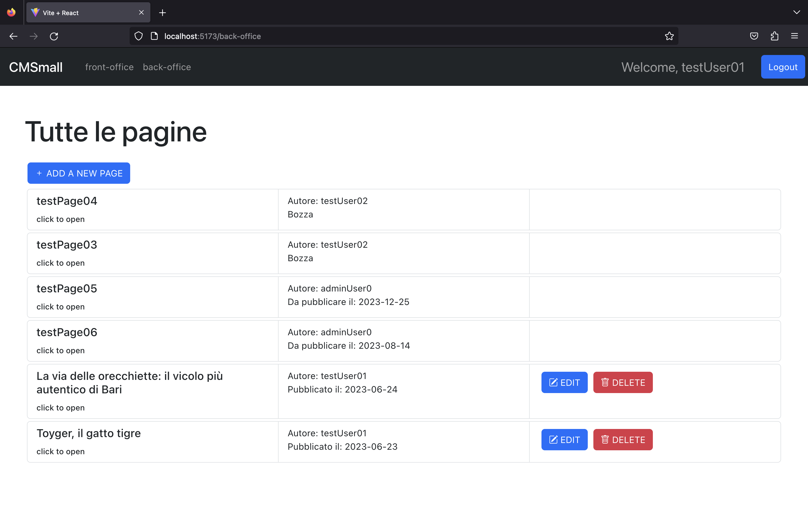

# CMSmall
## Description

Single Page Application for a small page manager.

## React Client Application Routes

- Route `/`: redireziona in `/front-office`
- Route `/front-office`: mostra tutte le pagine pubblicate in ordine cronologico per data di pubblicazione
- Route `/back-office`: protetta da utenti non loggati, mostra tutte le pagine (pubblicate, da pubblicare o bozze).
- Route `/pages/:pageId`: mostra il contenuto di una pagina
- Route `/addPage`: protetta da utenti non loggati, mostra il form per aggiungere una pagina
- Route `/editPage/:pageId`: route protetta da utenti non loggati che mostra il form per la modifica di una pagina
- Route `/login`: mostra il form per il login
- Route `*`: mostra un messaggio per URL non esistente/non previsto

## API Server

### __Pages__
- GET `/api/pages?filter`: login necessario per pagine non pubblicate o bozze
  - Descrizione: recupera le pagine in base valore del parametro della query
  - Request body: _None_
  - Request query parameter: _all || published_
  - Response: `200 OK` o `500 Internal Server Error` o `422 Unprocessable Entity` o `401 Unauthorized Access`
  - Response body: un array di pagine

  ```
  [{
      "id": 1,
      "userId": 1,
      "title": "Toyger, il gatto tigre",
      "author": "testUser01",
      "creationDate": "2023-06-23",
      "pubblicationDate": "2023-06-23"
  },
  ...
  ]
  ```
- GET `/api/pages/:id`:
  - Descrizione: recupera i blocchi appartenenti ad una pagina
  - Request body: _None_
  - Request parameter: l'id della pagina da recuperare
  - Response: `200 OK` o `500 Internal Server Error` `422 Unprocessable Entity` o `401 Unauthorized Access` o `404 File not found`
  - Response body: un oggetto contenente la pagina e l'array di blocchi associati alla pagina

  ```
  {
      "page": {
        "id": 1,
        "userId": 1,
        "title": "Toyger, il gatto tigre",
        "author": "testUser01",
        "creationDate": "2023-06-23",
        "pubblicationDate": "2023-06-23"
      },
      "blocks": [
        {
          "id": 1,
          "pageId": 1,
          "index": 0,
          "type": "header",
          "content": "test01"
        },
        ...
      ]
  }
  ```
- GET `/api/title`:
  - Descrizione: recupera il titolo del sito
  - Request body: _None_
  - Response: `200 OK` o `500 Internal Server Error` o `404 File not found`
  - Response body: un oggetto col titolo del sito

  ```
  {
      "title": "CMSmall"
  }
  ```
- POST `api/pages`: login necessario
  - Descrizione: crea una nuova pagina e blocchi associati sul database
  - Request body: un oggetto contenente la pagina e l'array di blocchi
  ```
  {
      "page": {
        "title": "Toyger, il gatto tigre",
        "pubblicationDate": "2023-06-23"
      },
      "blocks": [
        {
          "index": 0,
          "type": "header",
          "content": "test01"
        },
        ...
      ]
  }
  ```
  - Response: `200 OK` o `500 Internal Server Error` o `422 Unprocessable Entity` o `401 Unautorized Access`
  - Response body: l'id dell'oggetto appena creato
  
- PUT `api/pages/:id`: login e proprietà della pagina necessari o login come admin
  - Descrizione: modifica una pagina esistente sul database e blocchi associati
  - Request parameter: l'id della pagina da modificare
  - Request body (user): un oggetto contenente la pagina e un array di blocchi 
  ```
  {
      "page": {
        "id": 1,
        "title": "Toyger, il gatto tigre",
        "pubblicationDate": "2023-06-23"
      },
      "blocks": [
        {
          "index": 0,
          "type": "header",
          "content": "test01"
        },
        ...
      ]
  }
  ```
  - Request body (admin): un oggetto contenente la pagina e un array di blocchi e l'id del nuovo autore
  ```
  {
      "page": {
        "id": 1,
        "title": "Toyger, il gatto tigre",
        "pubblicationDate": "2023-06-23"
      },
      "blocks": [
        {
          "index": 0,
          "type": "header",
          "content": "test01"
        },
        ...
      ],
      userId: 1
  }
  ```
  - Response: `200 OK` o `500 Internal Server Error` o `422 Unprocessable Entity` o `404 File not found` o `403 Forbidden` o `401 Unautorized Access`
  - Response body: l'id dell'oggetto appena modificato

- DELETE `api/pages/:id`: login e proprietà della pagina necessari o login come admin necessari
  - Descrizione: elimina una pagina esistente sul database e blocchi associati
  - Request body: _None_
  - Request parameter: l'id della pagina da cancellare
  - Response: `200 OK` o `500 Internal Server Error` o `422 Unprocessable Entity` o `404 File not found` o `403 Forbidden` o `401 Unautorized Access`
  - Response body: un oggetto vuoto

- PUT `api/title`: login come admin necessario
  - Descrizione: modifica il titolo del sito
  - Request body: il nuovo titolo
  ```
  {
      "title": "CMSmall"
  }
  ```
  - Response: `200 OK` o `500 Internal Server Error` o `401 Unautorized Access` o `403 Forbidden`
  - Response body: il titolo appena aggiornato

  ```
  {
      "title": "CMSmall"
  }
  ```
  - GET `api/users`: login come admin necessario
  - Descrizione: recupera la lista di users
  - Request body: _None_
  - Response: `200 OK` o `500 Internal Server Error` o `401 Unautorized Access` o `403 Forbidden`
  - Response body: la lista di users

  ```
  [
    {
      "id": 1,
      "name: "test"
    },
    ...
  ]
  ```
  
### __Login__
- POST `/api/sessions`:
  - Descrizione: effettua il l'autenticazione rilasciando il cookie
  - Request body:
  ```
  {
      "username": "testuser01@polito.it",
      "password: "password"
  }
  ```
  - Response: `200 OK` o `401 Unautorized Access`
- GET `/api/sessions/current`:
  - Descrizione: valida il cookie/la sessione posseduti dal browser
  - Response: `200 OK` o `401 Unautorized Access`
- DELETE `/api/sessions/current`:
  - Descrizione: effettua il logout, cancellando la sessione dal server
  - Response: `200 OK`

## Database Tables

- Table `sitetitle`: (`id`, `title`)
  - Descrizione: contiene il titolo della pagina principale
- Table `users`: (`id`, `email`, `name`, `admin`, `hash`, `salt`)
  - Descrizione: contiene gli user registrati
- Table `pages`: (`id`, `userid`, `title`, `author`, `creationdate`, `publicationdate`)
  - Descrizione: contiene le pagine, associate ad uno user, che risulta autore della pagina
- Table `blocks`: (`id`, `pageid`, `index`, `type`, `content`)
  - Descrizione: contiene i blocchi delle pagine, ognuno associato ad una pagina, con un indice che ne indica l'oridine di visualizzazione all'interno, il tipo e il contenuto

## Main React Components

### ViewComponents.jsx
- `FrontOffice`: 
 - Serve per visualizzare le pagine pubblicate
- `BackOffice`:
 - Serve per visualizzare tutte le pagine con pulsanti per l'aggiunta, la cancellazione e la modifica delle pagine
- `PageView`:
 - Serve per visualizzare il contenuto di una pagina. Per gli utenti loggati, mostra anche le opzioni di modifica e cancellazione
### NavbarComponents.jsx
- `Navigation`:
 - Barra di navigazione con link per il front e back office, la modifica del titolo della pagina in caso di utente admin e pulsante per login/logout
### EditComponents.jsx
- `EditPage`:
 - Mostra il form per la modifica di una pagina, con possibilità di cambiare il titolo, data di pubblicazione, eliminare, modificare e aggiungere i blocchi della pagina. Per l'admin è presente anche l'opzione per modificare l'autore.
- `AddPage`:
 - Mostra il form per l'aggiunta della pagina, con tutte le funzionalità descritte per la modifica (tranne che per la modifica dell'autore, che di default sarà l'utente che crea la pagina)
### AuthComponents.jsx
- `LoginForm`:
 - Mostra il form per il login

## Screenshots

Schermata di visualizzazione di tutte le pagine



Schermata di aggiunta di una pagina


## Users Credentials

- `testuser01@polito.it`, `password`
- `testuser02@polito.it`, `password`
- `testuser03@polito.it`, `password`
- `testadmin0@polito.it`, `password`
